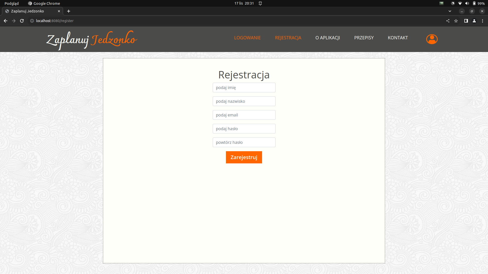

# ScrumLab

#### This is a team project in the Scrum system. The result of this workshop is an application for managing cooking recipes and daily plans.

# Home Page

This is the landing page of the website.

# Recipes

You can visit the recipes section where, without an account, you have access to all recipes added by users.

# Registration

Here, you can create an account on our website.

If you make any mistakes, don't worry. A window will appear with instructions on what you should do to register correctly.

# Login

If the registration process went correctly, you can log in to your account.

You will be guided here as well. In case of any mistakes, just follow the instructions.

# Dashboard

Finally, you have access to your account! :)

# Recipes List

In this section, you can check the list of your recipes. You can view details, edit, or delete any recipe.

## Recipe Details

## Recipe Edit

# Plans

In this section, you can check the list of your plans. You can view details, edit, or delete any plan.

## Plan Details

## Plan Edit

# Add Recipe To Plan

If you have some recipes and you have made a plan, here you can add recipes and create your own personalized plan.

# Edit Data

To change data, you can use the change data form.

# Edit Password

To change the password, you can use the change password form.

# Contact

If you have any questions, feedback or issues, feel free to reach out to me:

- Email: cezary.wozakowski@gmail.com
